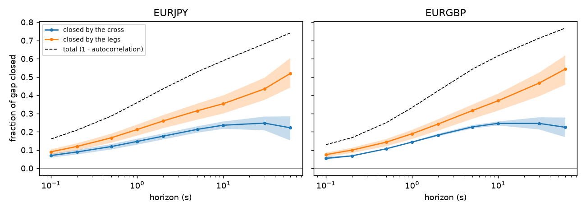
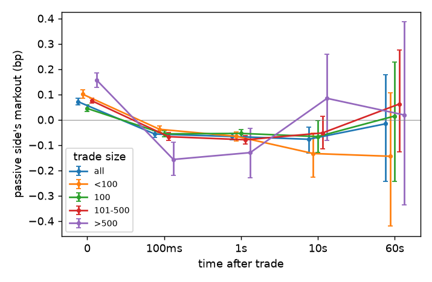
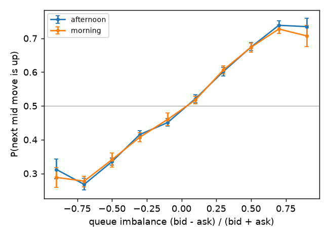

# kdb-tick-research

A small kdb+ tick stack (tickerplant, RDB, date-partitioned HDB) with two
studies on top of it. The main one asks how quickly FX crosses like EUR/JPY
reprice when their dollar legs move, and whether the gap between the quoted
cross and the one implied by the legs is worth trading. The second uses a
day of Nasdaq level-2 data for SPY to look at markouts, queue imbalance and
order flow imbalance.

It's about 400 lines of q and 1,000 of Python, plus tests.

## Layout

```
q/schema.q      quote and trade tables, one schema for equities and FX
q/tick.q        tickerplant (cut down from kdb+tick)
q/rdb.q         real-time database: replays the TP log on startup, writes the HDB at end of day
q/checks.q      sanity checks on the quote stream, with a per-symbol hold
q/analytics.q   research queries that run inside the HDB
q/hdb.q         HDB with analytics.q loaded
ktr/            Python: data readers, feed handler, q process helper, block bootstrap
scripts/        download, load, backfill and the two studies
tests/          pytest; the q tests start real q processes
results/        tables and figures used below
```

## The tick stack

A Python feed handler replays recorded data into the tickerplant, which logs
it and publishes to two subscribers: the RDB, and a checks process that
applies the kind of control rules that sit in front of a trading algo.

```
feed.py --> tick.q --+--> rdb.q ----> db/<date>/   (at end of day)
              |      +--> checks.q    alerts + tradeable status per symbol
              v
          logs/tp<date>
```

`tick.q` follows the shape of kx's kdb+tick but is trimmed so it fits on a
screen. Because everything here is replayed history, timestamps come from the
feed rather than `.z.p`, and the day rolls when data for a later date arrives
instead of at wall-clock midnight. Each batch is checked against the schema
before it's logged, since one malformed message in the log breaks every
replay after it. The log is written before publishing.

`rdb.q` subscribes and asks for the log position in the same synchronous
call, then replays that many messages with `-11!`, so a restarted RDB misses
nothing and double counts nothing (there's a test that kills it mid-day). At
end of day `.Q.dpft` writes each table sorted by sym with `p#` on sym.

`checks.q` flags crossed quotes, missing prices, spreads wider than a
per-symbol limit, jumps in the mid, and gaps in the feed, all on data time so
a replay behaves the same as live. The first four put the symbol on hold for
5 seconds, which is what an algo would check before quoting.

Some timings on my machine: the SPY day (3.9M rows) goes through
TP -> RDB + checks in about 6 seconds, about 600k rows/s with the TP log on.
The FX year (about 84M quotes over 260 days) backfills in under two
minutes, about 820k rows/s with the log off. The HDB is 5.3GB. The FX research query below
builds a 360,000-point grid with three asof joins and runs everything for a
date in about 0.4s.

## Study 1: FX crosses against their legs

### Data

Dukascopy tick quotes for EUR/USD, USD/JPY, EUR/JPY, GBP/USD and
EUR/GBP for 2025, 07:00-17:00 UTC (London open to New York lunchtime). Two
triangles: EUR/JPY = EUR/USD x USD/JPY and EUR/GBP = EUR/USD / GBP/USD. This
is one venue's quotes, not the interbank market, and they update roughly every
100ms, so nothing faster than that can be seen.

### Method

For each day, the quotes of all three pairs are asof-joined onto
a 100ms grid, and grid points where any pair hasn't updated for a minute are
dropped (the feed was down, not the market quiet). The gap is the quoted cross
mid over the synthetic mid from the legs, in basis points. At each horizon
from 0.1s to 60s I regress the cross's move and the synthetic's move on the
current gap, centred within each day. The two slopes say how much of a gap is
closed by the cross moving and how much by the legs moving, and together they
give the gap's autocorrelation. Confidence intervals resample whole days
(2,000 draws). q reduces each day to a few sums, so only those cross to Python.

### Results

Full year, 259 days (Christmas Day dropped, it has almost no quotes):

| | EUR/JPY | EUR/GBP |
|---|---:|---:|
| mean \|gap\| (bp) | 0.235 | 0.100 |
| sd of gap (bp) | 0.613 | 0.153 |
| mean half-spread of the cross (bp) | 0.272 | 0.424 |
| share of time \|gap\| > half-spread | 19.7% | 2.6% |
| half-life of the gap | 4.1s | 3.9s |

Fraction of the gap closed after 1s and 10s (95% CI):

| | by the cross, 1s | by the legs, 1s | by the cross, 10s | by the legs, 10s |
|---|---|---|---|---|
| EUR/JPY | 0.15 [0.13, 0.16] | 0.21 [0.18, 0.24] | 0.24 [0.22, 0.26] | 0.35 [0.30, 0.40] |
| EUR/GBP | 0.14 [0.14, 0.15] | 0.19 [0.16, 0.21] | 0.25 [0.23, 0.26] | 0.37 [0.32, 0.41] |



What I expected was a cross that lags its legs and catches up within a few
hundred milliseconds. That isn't what happens in this data. The gap is slow
to go away (a half-life of about 4 seconds, and a quarter of it is still
there after a minute), and at every horizon more of it is closed by the legs
moving towards the cross than by the cross moving towards the legs. Below a
second the difference is small, but it widens from there. That holds
in both triangles and in both halves of the year (tables in
`results/fx_study.md`). So the cross isn't simply a derived price here; when
the two disagree, the legs do more of the adjusting.

One boring explanation would be quote noise: the synthetic mid inherits
flicker from two quotes, and flicker reverses, which would look like the legs
closing the gap. For EUR/JPY the lag-1 autocorrelation of 100ms returns is
positive for both the cross (+0.07) and the synthetic (+0.02), so that isn't
what's going on there. For EUR/GBP both are negative and the synthetic more so
(-0.10 against -0.05), so some of the legs' share in that triangle probably
is noise.

### Is it tradeable?

No. I tested buying the cross at the ask when it was
cheap against the synthetic (selling when rich) and closing at the bid after a
holding period, one position at a time, with latency from 0 to 1s. The
threshold and holding period were picked on January-June and only reported on
July-December:

| | latency | picked on H1 | H2 trades | H2 mean P&L per trade (bp) |
|---|---:|---|---:|---|
| EUR/JPY | 0 | 0.75bp, 30s | 11,310 | -0.40 [-0.45, -0.34] |
| EUR/JPY | 100ms | 0.25bp, 30s | 58,352 | -0.45 [-0.48, -0.43] |
| EUR/GBP | 0 | 0.25bp, 30s | 73,523 | -0.67 [-0.69, -0.66] |
| EUR/GBP | 100ms | 0.25bp, 30s | 73,396 | -0.74 [-0.75, -0.73] |

Even with zero latency it loses most of the round-trip spread. Most of the time
the gap is smaller than the half-spread, and when it isn't, the cross only
covers part of it. So there's nothing here for a taker. The more useful
point is the first result: a cross price built only by multiplying the legs
would be throwing information away, because when the two disagree the legs
tend to move towards the quoted cross more than the other way round.

## Study 2: SPY order book, 28 January 2021

Nasdaq TotalView-ITCH for SPY from Databento (market-by-price, 10 levels),
regular hours only. It's one day, one venue, and an odd day (the GameStop
squeeze), so this is about showing the method rather than a general result.
Everything is fitted on the morning and checked on the afternoon, and CIs
resample 5-minute blocks.

### Markouts

What a passive fill was worth, marked to the mid at later
horizons, from the market maker's side. Fills from one aggressive order that
swept several resting orders are merged first.

| order size | orders | effective half-spread (bp) | 100ms | 1s | 60s |
|---|---:|---|---|---|---|
| all | 67,868 | 0.19 [0.17, 0.21] | -0.06 [-0.07, -0.04] | -0.07 [-0.08, -0.05] | -0.02 [-0.24, 0.18] |
| >500 shares | 1,788 | 0.32 [0.29, 0.36] | -0.16 [-0.22, -0.09] | -0.13 [-0.23, -0.03] | 0.02 [-0.34, 0.39] |

Within 100ms the price has moved against the passive side by more than the
half-spread it earned, and more so for big orders. Past 10 seconds the
intervals are too wide to say anything.



### Queue imbalance

(bid size - ask size) / (bid size + ask size) at the
touch, against the direction of the next mid move, with one-tick spreads only.
Using the morning's curve to call the direction in the afternoon gets it right
62.4% of the time [61.8%, 62.9%] over about 122,000 mid moves. The morning and
afternoon curves are almost on top of each other.



### Order flow imbalance

OFI (Cont, Kukanov and Stoikov, 2014) explains
about 60% of the variance of the mid move in the same 1-second bucket (0.59
out of sample), close to what the paper reports. It explains nothing about the
next bucket (out-of-sample R2 of -0.001 at 1s, -0.017 at 10s). It describes
price moves, it doesn't forecast them.

## Sanity checks

On the SPY day almost everything fires outside regular hours: all 59 jumps
are pre-market and all 7 feed gaps are after hours. The wide-spread alerts
inside regular hours cluster in the first half hour after the open.

On the FX year, the wide-spread rule fires on 115 of the 260 trading days. Most alerts
come at 07:00 UTC as the session starts (30%) and at 12:00-13:00 UTC around US
data releases (48%). The worst days are Good Friday (18 April), the day after
Thanksgiving, Christmas Day, the tariff days of 10-11 April, and CPI and
payrolls days. That's what you'd want the rule to catch. Counts are in
`results/checks_*.csv`.

## Things that caught me out

* A line containing only `/` starts a block comment in a q script, and it runs
  until a line containing only `\`. Every file header I wrote had one, so for a
  while each script loaded nothing after its first couple of lines, without
  any error.
* Nulls compare as smaller than everything in q, so `0n < -5` is true. Any
  threshold test needs a null filter first, and `signum 0n` is -1.
* `aj` takes the last quote at or before a time. On ITCH data the book update
  caused by a trade has the same timestamp as the trade, so the mid "at the
  trade" already includes the trade's impact. Markouts start from `time-1`
  instead.
* q compares floats with a small tolerance and numpy doesn't. One test built
  prices with float arithmetic, so q saw two bids as equal where numpy didn't.
* pykx sends a DataFrame whose index doesn't start at 0 as a keyed table, so
  without resetting the index every replay window after the first gets
  rejected by the tickerplant.
* pykx also swaps numpy's memory allocator for one that allocates in q's
  memory. On Windows that segfaulted whenever a large array was freed.
  `PYKX_NO_ALLOCATOR` turns it off; Python only talks to q over IPC here, so
  nothing is lost.

## Running it

1. KDB-X Community Edition (free): get a licence at
   https://developer.kx.com/products/kdb-x/install, put `q.exe` in
   `~/kx/w64/` and the licence as `~/kx/kc.lic`. Set `QHOME` or `QEXE` if
   it's somewhere else.
2. `python -m venv .venv`, then `pip install -r requirements.txt`.
3. `python -m pytest` (the q tests skip themselves if q isn't found).

Market data isn't in the repo because of the licences:

* SPY: Databento `XNAS.ITCH`, schema `mbp-10`, 2021-01-28, saved as
  `data/raw/xnas-itch-20210128.mbp-10.dbn.zst`.
* FX: `python scripts/download_fx.py 2025-01-01 2025-12-31` fetches the
  07:00-17:00 UTC session from Dukascopy. Their server throttles, so it takes
  a few hours; rerun it to pick up anything that failed.

Then:

```
python scripts/load_spy.py                          # SPY day -> db/2021.01.28
python scripts/backfill_fx.py 2025-01-01 2025-12-31 # FX year -> db/
python scripts/spy_study.py
python scripts/fx_study.py
```
